# Automated VM Deployment with Startup Script
Skład grupy: Arleta Antosik, Aleksandra Barbacka, Aleksandra Kaziród, Monika Depka Prądzinska, Marianna Tybura
## Cel i zakres projektu
Cel: Nauczenie się automatyzacji uruchamiania instancji VM z wykorzystaniem startup scriptów, dysków i metadanych.
Zakres: 
* Utworzenie własnego Instance Template z startup skryptem.
* Skrypt instaluje prostą aplikację (np. Nginx, Apache, Python Flask).
* Wdrożenie z szablonu kilku instancji.
* Test działania aplikacji.
* Konfiguracja reguł firewall i monitoringu.
## Krok pierwszy : Stworzenie dysku

1. Uruchomić Google Compute Engine
2. Wejść w Storage -> Disks -> Create Disk
* Name: projekt
* Location: Single Zone
* Region: us-central1
* Zone: us-central1-a
* Disk source type: Blank disk
* Disk settings:
* Disk type: Hyperdisk Balanced
* Access mode: Multiple VMs read-write
* Size: 50GB
* Snapshot schedule: leave empty (leave to defaults)
* Encryption: Google-managed
Naciśnąć na CREATE

Kompletna konfiguracja znajduje się w screenshotach (8-disk)
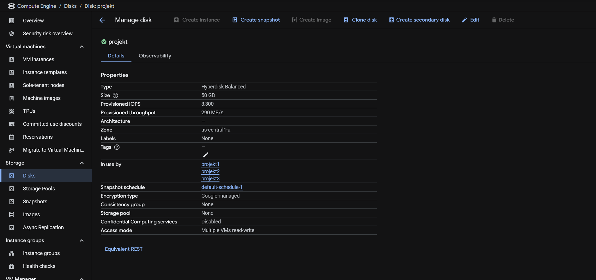

## Krok drugi : Stworzenie firewall rules

1. Uruchomić Network Security
2. Wejść w Cloud NGFW -> Firewall policies -> Create a network firewall rule
3. Stworzyć rules z poniższymi danymi

Rule 1:
* Name: deny-database-ports
* Description: blokuje dostęp do MySQL i PostgreSQL z internetu
* Logs: off
* Priority: 1000
* Direction of traffic: Ingress
* Action on match: Deny
* Target tags: deny-database-ports
* Source filter: 0.0.0.0/0
* Protocols and ports: TCP: 3306
* Enforcement: Enabled
* Insights: None 

Rule 2:
* Name: allow-monitoring-stack
* Description: Pozwala na dostęp do Prometheus (9090), Node Exporter (9100) i Grafana (3000)
* Logs: off
* Priority: 1000
* Direction of traffic: Ingress
* Action on match: Allow
* Target tags: allow-monitoring-stack
* Source filter: 0.0.0.0/0
* Protocols and ports: TCP: 3000, 9090, 9100
* Enforcement: Enabled
* Insights: None 

Kompletna konfiguracja znajduje się w screenshotach (4, 5-firewall-policies)

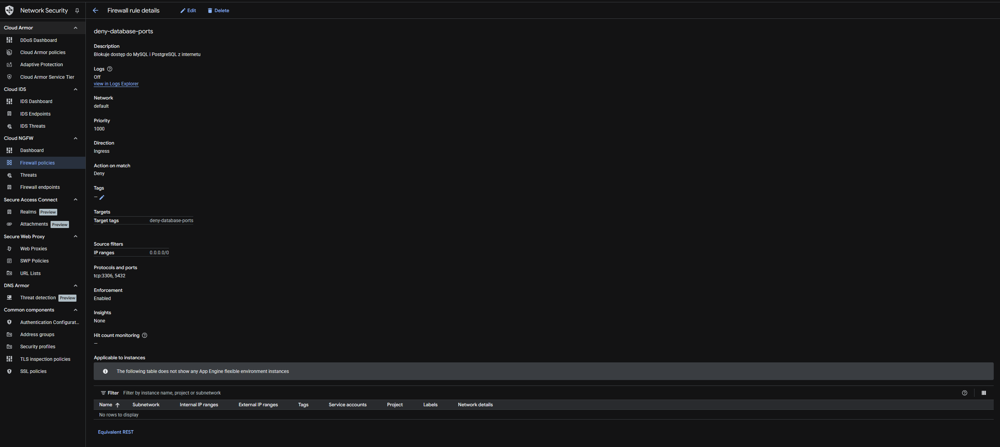


## Krok trzeci : Stworzenie Instance Template ze Startup Script

1. Uruchomić Google Compute Engine
2. Wejść w Virtual Machines -> Instance templates -> Create instance template -> Podać wymagane informacje
* Name: projekt11112025
* Location: Regional us-central1 (Iowa)
* Zone: Any
* Machine Configuration:
* Series: N4
* Machine Type: n4-standard2
* Firewall
* Allow HTTP Traffic
* Advanced Options
* Network tags(zatwierdzaj każdy tag klikając "enter"):
* http-server
* deny-database-ports
* allow-monitoring-stack
* Management -> Automation -> Startup Script:
* Skopiować poniższy kod:
```bash
#!/bin/bash #shebang wskazuje interpretator kodu
apt update #aktualizuje listę pakietów
apt install -y apache2 #instaluje pakiet apache2
systemctl start apache2 #uruchamia usługę systemową apache2
systemctl enable apache2 #konfiguruje automatyczne uruchamianie apache2 przy każdym uruchomieniu maszyny
```
Disk: Attach existing disk -> projekt
3. Nacisnąć Create

Kompletna konfiguracja znajduje się w screenshotach (1, 2, 3 instance template)
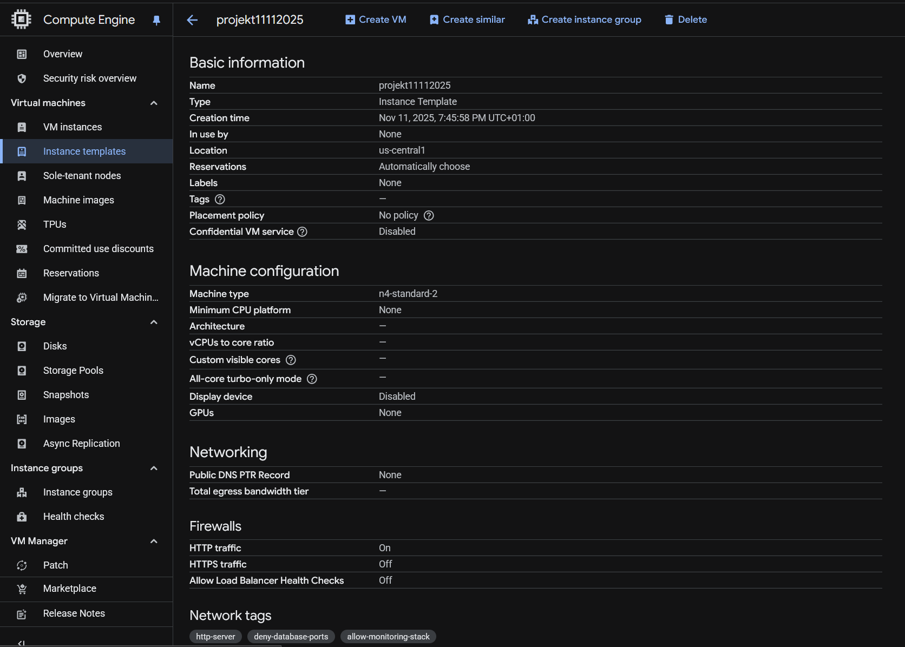

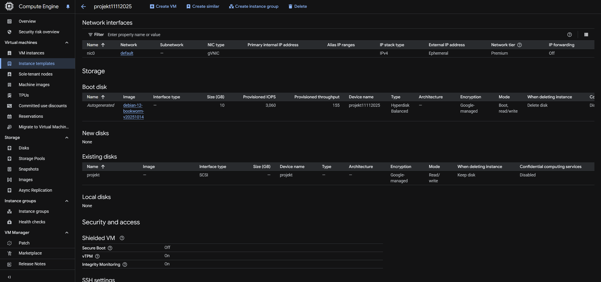

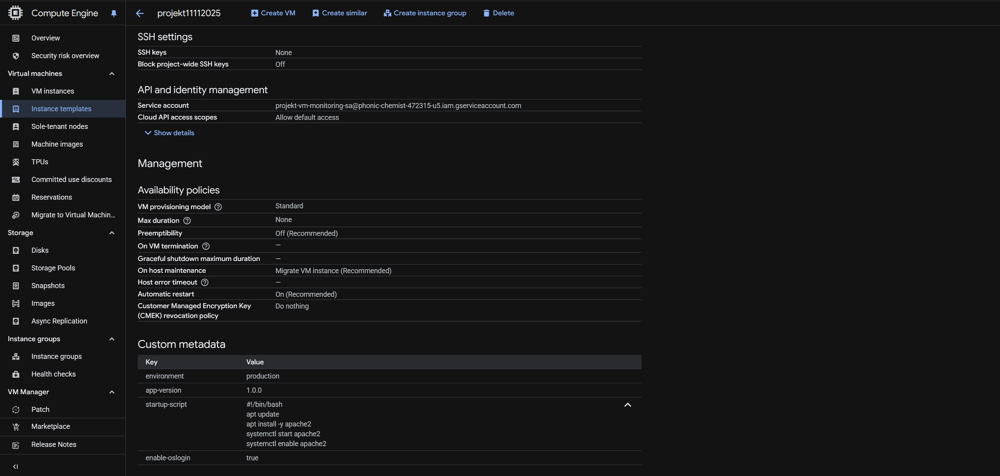

## Krok czwarty : Stworzenie konta Service Account

1. Uruchomić IAM & ADMIN
2. Wejść w Service Accounts -> Create service account -> Podać wymagane informacje
   Name: projekt-vm-monitoring-sa
   Description: Service account for VM monitoring and logging
3. Kliknąć: Create and continue
4. Dodać w części Permissions poniższe Roles:
* Logs Writer
* Monitoring Metric Writer
5. Kliknąć na "Done"

Kompletna konfiguracja znajduje się w screenshotach (6,7-IAM)
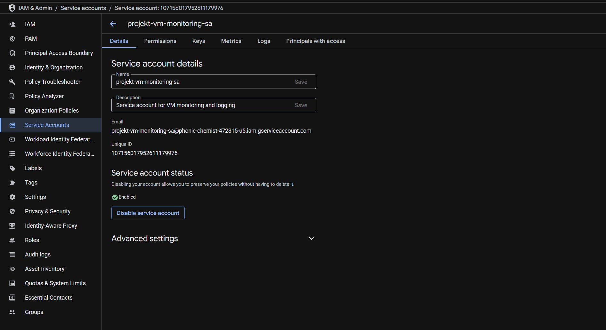

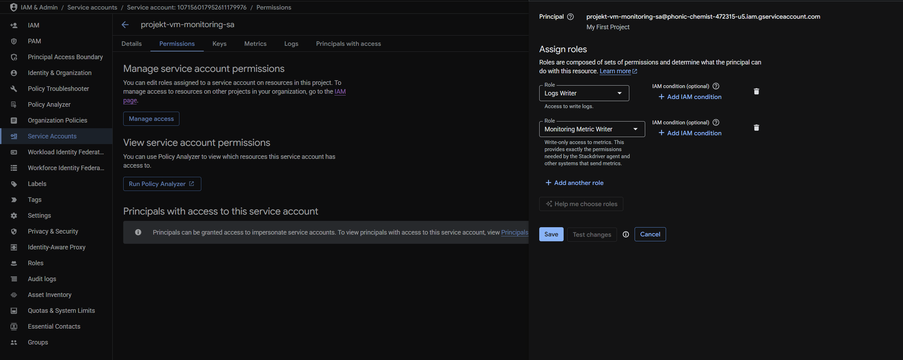

## Krok piąty : Stworzenie VM

1. Uruchomić Google Compute Engine
2. Wejść w Instance templates -> projekt11112025 -> Create VM -> Create
3. Powtórzyć 2 razy, aby utworzyć 3 VM
(screenshot 9-VM)
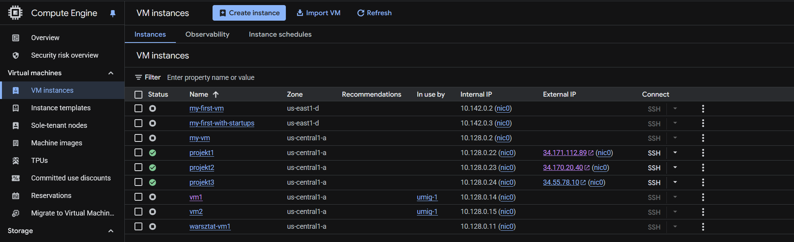

## Krok szósty : Testowanie
1. Sprawdzenie, czy VM działa: wpisać w adres przeglądarki external IP VM (screenshot 10-VM)
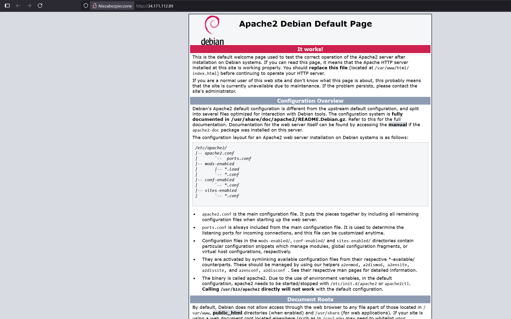
3. Sprawdzenie logów i metryk: uruchomić Compute Engine -> VM Instances -> kliknąć na nazwę VM -> tab "Observability" (11-metrics, 12- logs)
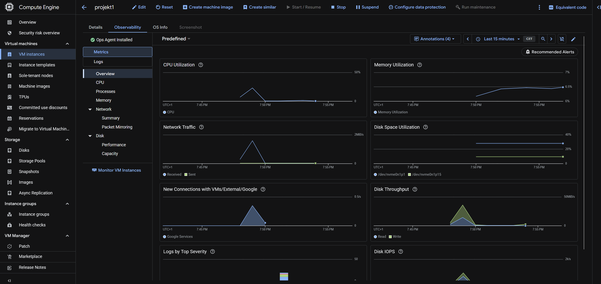
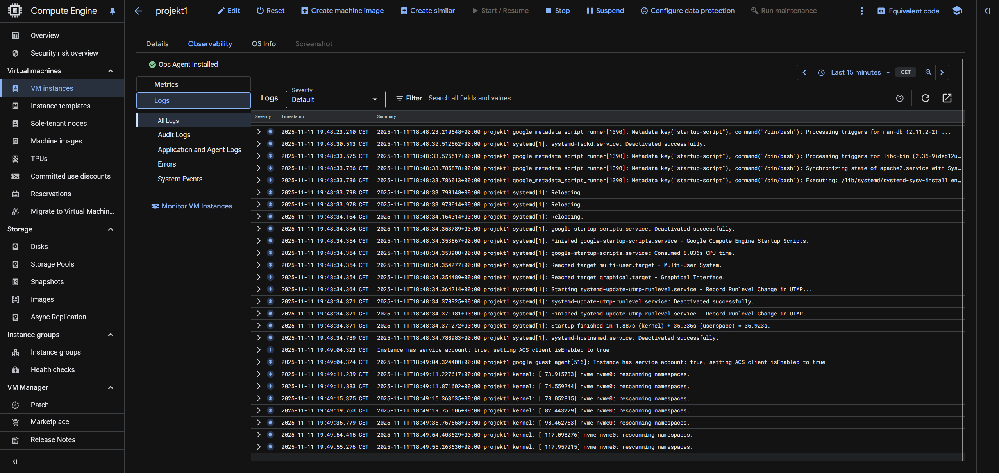

4. Sprawdzenie stress metrics:
   1. Wejść do VM klikając na "SSH" przy nazwie
   2. Wpisać komendę `sudo apt-get install stress -y`
   3. Po zainstalowaniu wpisać komendę `stress --cpu 2 --timeout 120` (screenshot 13-metrics, 14-stress-metrics, 15-stress-metrics)
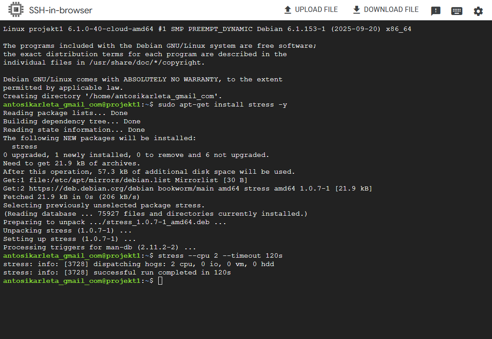
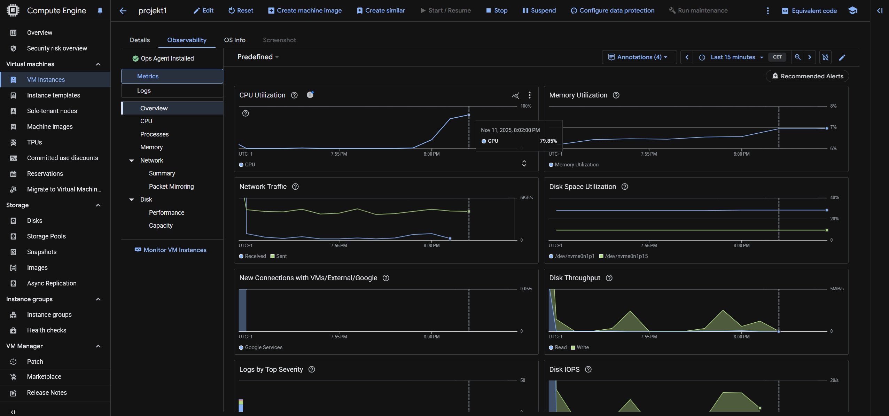


